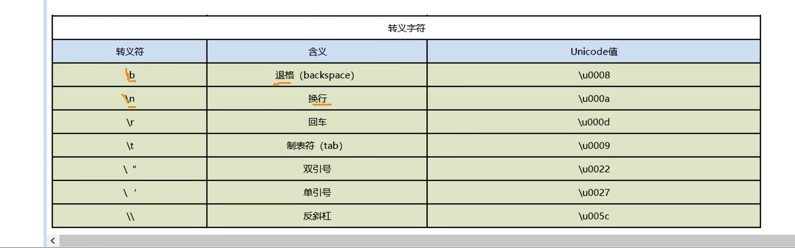

### 简介

- golang 中没有专门的字符类型，而是用byte 来保存
- golang 中使用的事 utf-8编码
- 用 单引号 表示 不要使用双引号  双引号是字符串的表示方法
- 本质是一个整数，可以参与运算，输出字符时，是输出其对应的码值 也就是整数
- 范围为 0~255， 超出这个范围的 会提示错误，溢出
- 

#### 字母、数字、标点等字符
是ASCII码 对应的整数值，可以去查看ASCII码表
ASCII码 就是 UNICODE码的前128位

#### 中文字符
对应的事 Unicode码，需要转换成对应的整数值，可以去查看Unicode码表

### 总结
unicode 是字符集， UTF-8是unnicode的其中一种编码格式

### 转义字符
